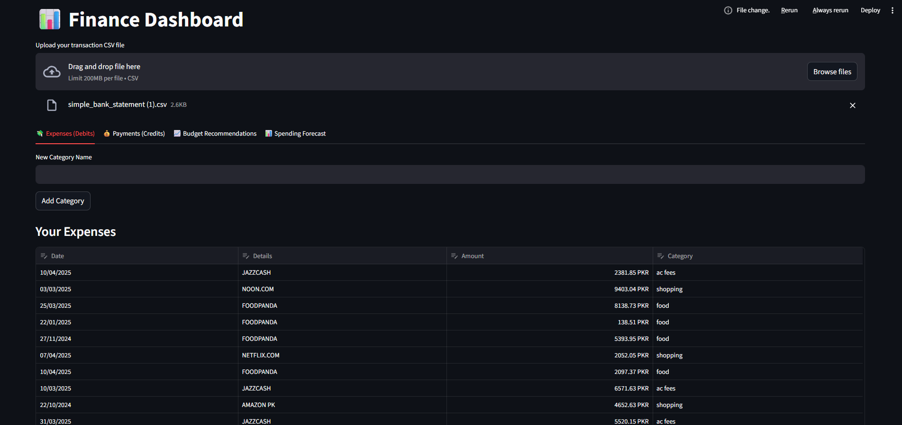
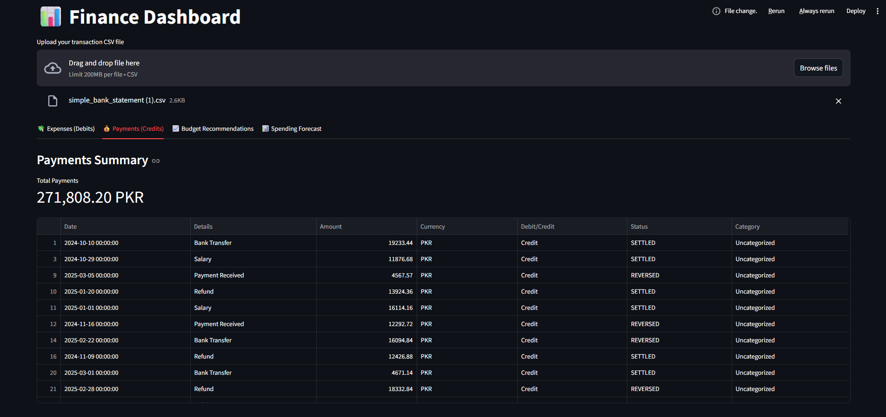
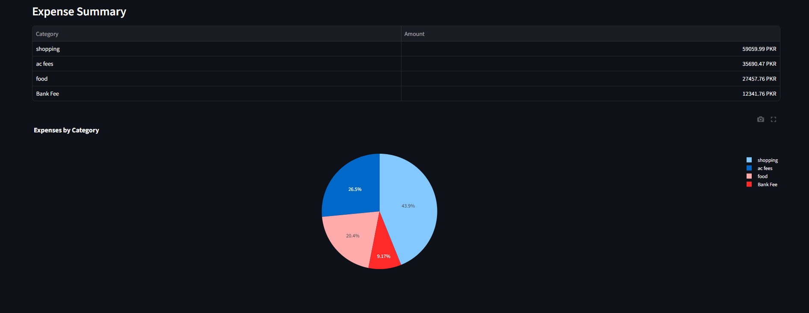
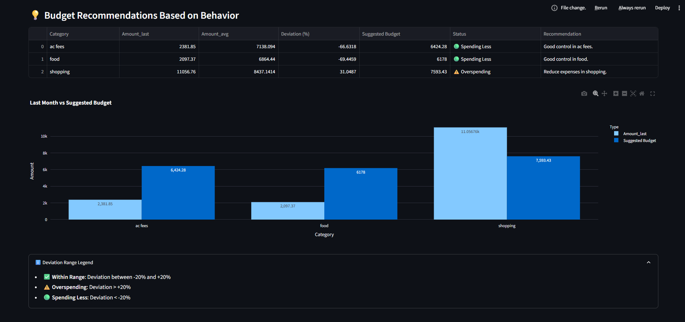
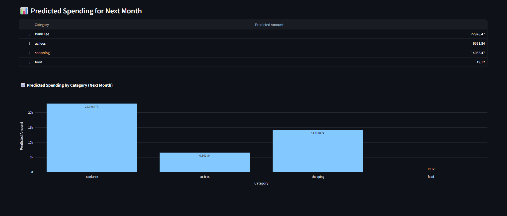

# Finance-Tracker
A smart personal finance dashboard built with Python, Streamlit, Plotly, and scikit-learn. This app allows users to upload CSV bank statements, categorize expenses, visualize trends, receive budget recommendations, and forecast next month’s spending using machine learning.

## 🚀 Features
- Upload CSV bank statements
- Auto-categorize expenses
- Visualize spending by category
- Monthly budget recommendations
- Forecast future spending (ML)

## 📸 Screenshots

### Dashboard

### Payments Tab

### Visuals through piechart

### Analysis

### Future Predictions

